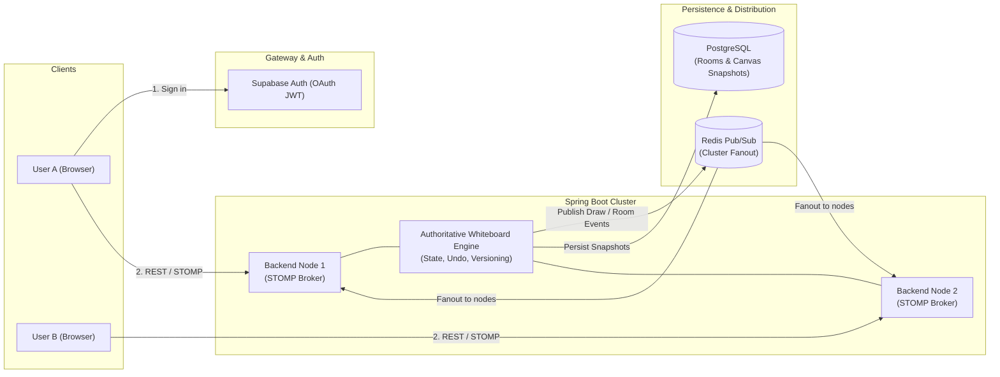

# 3P-Doodle

[](https://react.dev/)
[](https://spring.io/projects/spring-boot)
[](https://stomp-js.github.io/)
[](https://redis.io/)
[](https://supabase.com/)

3P-Doodle is a real-time collaborative whiteboard platform engineered for synchronized paired drawing. It couples a responsive React HTML5 Canvas frontend with a server-authoritative Spring Boot backend, featuring multi-server horizontal scaling through Redis Pub/Sub and durable session snapshot persistence in PostgreSQL.

---

## Key Features

* **Real-Time Synchronized Canvas**: Midpoint quadratic curve smoothing (`quadraticCurveTo`), rounded line caps, and batched point transmission deliver 60 FPS drawing synchronization between paired users without polygonal degradation.
* **Server-Authoritative Engine**: The backend maintains canonical canvas state, stroke versioning, and validates room membership for every draw command (`START`, `MOVE`, `END`, `CLEAR`, `UNDO`).
* **Durable Snapshot Persistence**: Whiteboard snapshots are saved to PostgreSQL at stroke completion and mutation boundaries. Clients reliably restore canvas state upon page refresh or reconnection via REST state endpoints.
* **Multi-Server Scalability (Redis Pub/Sub)**: Built-in support for single-instance in-memory messaging with automatic fallback, switching dynamically to Redis Pub/Sub for horizontal fanout across clustered backend instances.
* **Room Lifecycle Management**: Generates 6-character room codes with 10-minute expiry windows, automatic stale-session cleanup, and WebSocket push notifications (`/topic/room/{code}`) on partner connection changes.
* **Token-Hardened Security**: Supabase OAuth integration with backend JWT validation as an OAuth2 Resource Server. STOMP inbound channel interceptors enforce socket principal authentication and subscription-time room authorization.

---

## Architecture



---

## Tech Stack

| Component | Technologies |
|---|---|
| **Frontend** | React 19, TypeScript, Vite, Framer Motion, HTML5 Canvas API, `@stomp/stompjs` |
| **Backend** | Java 21, Spring Boot 4, Spring Data JPA, Spring WebSocket/STOMP, Spring Security (OAuth2 Resource Server), Spring Data Redis |
| **Database & Auth** | Supabase PostgreSQL (via HikariCP pooler), Supabase Auth (Google OAuth & JWT) |
| **Realtime Messaging** | STOMP over WebSockets (client-to-server), Redis Pub/Sub (inter-server distribution) |

---

## API & Realtime Protocol Reference

### REST Endpoints

| Method | Endpoint | Description | Authentication |
|---|---|---|---|
| `POST` | `/room/create` | Create a new room or return current waiting room | Bearer JWT |
| `POST` | `/room/join` | Join an existing room using a 6-character code | Bearer JWT |
| `GET` | `/room/status` | Fetch current room status and partner information | Bearer JWT |
| `POST` | `/room/leave` | Leave active room and notify paired partner | Bearer JWT |
| `GET` | `/whiteboard/state?roomCode={code}` | Fetch authoritative canvas state snapshot from database | Bearer JWT |

### WebSocket (STOMP) Destinations

| Type | Destination | Description |
|---|---|---|
| **Handshake** | `/ws` | STOMP WebSocket connection endpoint |
| **Publish** | `/app/draw` | Dispatch user stroke events (`START`, `MOVE`, `END`, `CLEAR`, `UNDO`) |
| **Subscribe** | `/topic/draw/{roomCode}` | Stream real-time stroke events for the specified room |
| **Subscribe** | `/topic/room/{roomCode}` | Stream room status transitions (`PAIRED`, `NO_ROOM`) |

---

## Project Structure

```text
3P-Doodle/
├── Backend/
│   ├── src/main/java/com/_P_Doodle/Backend/
│   │   ├── Config/        # WebSocket, Redis, Security, and Jackson beans
│   │   ├── Controller/    # REST & STOMP controllers
│   │   ├── Model/         # Entities and event DTOs
│   │   ├── Repository/    # Spring Data JPA repositories
│   │   ├── Security/      # STOMP channel interceptors & security filters
│   │   └── Service/       # Authoritative state service & realtime broadcasters
│   └── src/main/resources/
│       └── application.yml
├── Frontend/
│   ├── src/
│   │   ├── components/    # Landing animations, overlays, loaders
│   │   ├── context/       # Auth context and Supabase integration
│   │   ├── lib/           # Realtime STOMP factory, API helpers, canvas types
│   │   └── pages/         # LandingPage, OptionScreen, PlaygroundPage (Canvas)
│   └── vite.config.ts
└── docs/
    └── CURRENT_FEATURES.md # In-depth technical changelog and specifications
```

---

## Getting Started

### Prerequisites

* Java 21
* Maven 3.9+
* Node.js 18+ and npm
* Supabase project (Auth and PostgreSQL)
* Optional: Redis instance (for multi-server cluster mode)

---

### 1. Backend Setup

1. Navigate to the backend directory:
   ```bash
   cd Backend
   ```

2. Configure environment variables in your environment or `.env` file:
   ```env
   DB_USERNAME=postgres.<your-supabase-tenant>
   DB_PASSWORD=your-database-password
   DB_ISSUER_URI=your-supabase-project-ref

   # Optional: Multi-Server Redis Configuration (Defaults to false)
   REDIS_ENABLED=false
   REDIS_HOST=localhost
   REDIS_PORT=6379
   REDIS_PASSWORD=
   REDIS_CHANNEL=whiteboard-events
   REDIS_ROOM_CHANNEL=room-events
   ```

3. Run the application:
   ```bash
   mvn spring-boot:run
   ```
   The backend starts at `http://localhost:8080`.

---

### 2. Frontend Setup

1. Navigate to the frontend directory:
   ```bash
   cd Frontend
   ```

2. Create a `.env` file:
   ```env
   VITE_SUPABASE_URL=https://<your-supabase-project-ref>.supabase.co
   VITE_SUPABASE_ANON_KEY=your-supabase-anon-key
   VITE_API_URL=http://localhost:8080
   ```

3. In your Supabase Dashboard under Authentication -> URL Configuration:
   * Set Site URL to `http://localhost:5173`
   * Add `http://localhost:5173/**` and `http://localhost:5173/Home` to Redirect URLs.

4. Install dependencies and start the development server:
   ```bash
   npm install
   npm run dev
   ```
   Open `http://localhost:5173` in your browser.

---

## Testing

Run backend tests:
```bash
cd Backend
mvn test
```

Build the frontend client:
```bash
cd Frontend
npm run build
```

---

## License

This project is licensed under the MIT License - see the LICENSE file for details.
